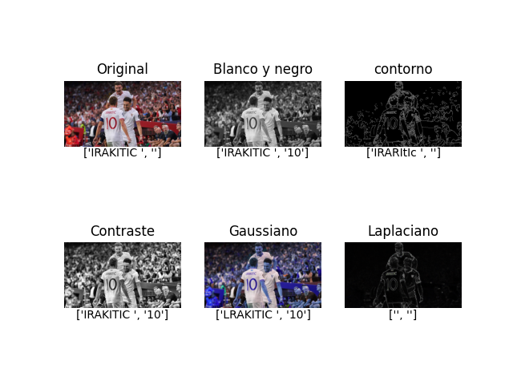

# Trabajo PID
Trabajo realizado por Javier Calderon Álvarez, Alberto Martín Martín y Antonio Saborido

## Resumen del Proyecto:
El proyecto se centra en el desarrollo de un sistema de reconocimiento de jugadores de fútbol utilizando imágenes de sus camisetas como entrada. La idea es aprovechar la información visual de las camisetas, que suelen estar marcadas con el nombre y el número del jugador, para identificar automáticamente a quién pertenece la camiseta. Una vez identificado el jugador, el sistema accederá a la base de datos del videojuego EA Sports FC 24 para extraer sus estadísticas.

## Objetivos del Proyecto:

 - Reconocimiento de Jugadores: El objetivo principal es desarrollar un algoritmo de reconocimiento de jugadores que sea capaz de identificar a quién pertenece una camiseta de fútbol a partir de una imagen de la misma. Esto implica la detección y extracción de texto, como el nombre y el número del jugador, de la imagen de la camiseta.

 - Integración con EA Sports FC 24: Una vez que se ha identificado al jugador a través de la camiseta, el sistema debe ser capaz de acceder a la base de datos del videojuego EA Sports FC 24. El objetivo es extraer automáticamente las estadísticas del jugador, como su posición, habilidades, historial de partidos, etc.

 - Interfaz de Usuario Amigable: Para hacer que la herramienta sea accesible y útil, se pretende desarrollar una interfaz de usuario utilizando la propia terminal que permita a los usuarios cargar imágenes de camisetas y obtener las estadísticas de los jugadores de forma sencilla.

## Instalacción

En windows se puede ejecutar directamente el script "scriptInstalacion.bat", o tambien se pueden instalar las siguientes librerias manualmente.

- pip install pandas
- pip install torch (Solo es necesario en windows)
- pip install easyocr 
- pip install pillow
- pip install pytesseract
- pip install os-sys

## Breve descripcion de funcionamiento

El proyecto está dividido en 4 archivos. 
    - mainFile.py: Es el archivo que se debe ejecutar y en donde se encuentran la mayoria de funciones.
    - menus.py: Contiene todos los menu que van apareciendo por consola
    - filtros.py: En el están los filtros que se pueden aplicar a las imagenes para poder obtener una mejor lectura
    - comparacionDB.py: En este archivo comparamos lo que hemos leido gracias a los filtros y las librerias con posibles jugadores que hay en la base de datos de EA Sports.

Después tambien está el archivo 'comparativaGlobal.py' que es un archivo que al ejecutarlo y seleccionar una imagen para analizar procederá a comparar las lecturas de las dos librerias con todos los filtros a la vez, de esta forma se puede ver que filtro y qué libreria funciona mejor para cada archivo.

Por ejemplo, asi se verían los filtros para una imagen:
    

Y esto es lo que leemos con la libreria easyOcr por ejemplo:
-   Lectura imagen original: ['IRAKITIC ', '']
-   Lectura imagen blanca y negra:  ['IRAKITIC ', '10']
-   Lectura imagen con contorno: ['IRARItIc ', '']
-   Lectura imagen con mejora del contraste: ['IRAKITIC ', '10']
-   Lectura imagen suavizada (Gaussiano): ['LRAKITIC ', '10']
-   Lectura de mejora de nitidez Laplaciano:  ['', '']